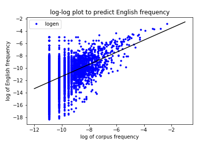

# **Presidential speech project**

*NOTE:* To run this project, run Presidents.ipynb one cell at a time, in sequential order.  The total run may take some time, perhaps at most a half hour.  The bottleneck is the function generate_overrep_words().  If you change NUMP to a smaller number (the most recent NUMP presidents are used) it can dramatically reduce the run time.  I would recommend doing this when you first try to run the file.

## Introduction

Understanding U.S. politics and history is a particularly important endeavour that is of interest to many people - both historians and citizens alike.  One indicator of the relevant issues in a particular era is the content of the president's speech.  Presidential speeches have been analyzed to determine the grade level of their speech, for instance.  In this project, I am analyzing the words used by each president to understand the topics on which they are speaking.

This project is an analysis of many presidential speeches from the site millercenter.org.  The site contains the text of at least one speech (and almost always more) given by each of the 44 presidents.

The goal is to cluster presidents into clusters based on the words that they use in their speeches.  This analysis can help us to understand how presidents' concerns, communication styles, and interests changed over time - a question of tremendous historical importance. 

Words are given more weight if (1) they are frequent in that president's speeches *and* (2) they are less common in the English language than other words that have a similar frequency in that president's speeches.  

In other words, if 'Soviet' and 'because' each makes up 1% of the words in a particular president's speeches, 'Soviet' would be given higher weight (for that president), since it is less common in English. 

Based on this weight function, presidents who use similar words are said to be similar and are grouped together.

How many clusters should we use?  According to an assessment of the silhouette coefficient, which is a measure of the quality of a clustering analysis, I found that two clusters is a good fit while three through six clusters are all about equally mediocre.  That said, in this document I will use three clusters, since it gives the reader more examples and therefore a better sense of what the algorithm can do.

The conclusion is that the three clusters of presidents are more or less consecutive in time.  The first cluster runs from George Washington to Andrew Johnson; the second from Ulysses S. Grant to Herber Hoover; and the third from Franklin D. Roosevelt to Donald Trump.  A holdout test set is used to verify that the clustering does not depend very much on the particular choice of speeches for each president.

## Findings

Based on the weight function, we can calculate the "characteristic words" of each cluster.  

*NOTE: the characteristic words and clusters reported here correspond to one run of the program.  Due to the random nature of the program, the same words and clusters will not necessarily result from every run.  To get a more stable list of words, try setting train_test = False to include all speeches rather than half.*

**Characteristic words for cluster A (Washington through Johnson):** heretofore, herewith, intercourse, continuance, pursuance, effectually, justly, effectual, tranquillity, tribes

Counting only nouns and words with semantic content: tribes, receipts, vessels, harbors, ports, territories

Analysis: Presidents are talking a lot more formally in this time period. Ships, ports, and harbors are clearly important; is this about commerce or about warships?  Maybe both.

**Characteristic words for cluster B (Grant through Hoover):** earnestly, tariff, heretofore, appropriation, intrusted, evils, gratifying, speedily, postmaster, enactment

Counting only nouns and words with semantic content: tariff, appropriation, postmaster, receipts, postal, armament, statute, nicaragua, cruisers, railroads

Conclusion: There seems to be more talk of financial issues than with the other clusters (tariff, appropriation, receipts).  There is evidently an ongoing conflict with Nicaragua, and railroads are important.

**Characteristic words for cluster C (FDR through Trump):** america’s, americans, allies, nation’s, soviet, nuclear, leaders, percent, tax, weapons, democracy, budget, bipartisan, jobs

Conclusion: this is the "America as a great power and centralized government" cluster. America has allies, opposes the Soviet Union, and has a strong identity as a nation and a democracy. There is also some partisan division that leads to valuing "bipartisan" legislation.

We can also examine the characteristic words for individual presidents.  In both cases, I count only words that have semantic content and I have omitted most proper names.

**Characteristic words for Trump:** DACA, dreamers, sequester, vetting, tremendous, immigration, businessperson, america’a, hardworking, thank

**Characteristic words for Obama:** inequality, likelier, jobs, bedrolls, autoworker, businesses, bipartisan, childcare, we’ve, reenergized

## Algorithm

### Weight function:

To judge which presidents are similar, we need to know how important each word might be.  For example, the word "the" appears very frequently, but probably is not that important in differentiating between the presidents.

The "weight" for each word is calculated as follows. The goal is to have a weight that reflects (1) the relative incidence of the word in the English language compared with other words of similar frequency in the speech corpus, (2) the overall incidence of the word in the speech corpus. Thus, a word that is highly unusual ("supercalifragilisticexpealidocious") but only appears once in the speech corpus is not that interesting. In contrast, a word that is very common, but appears only the usual amount in the corpus ("the") is also not that interesting. The weight for each word is computed as a sum of these two factors.

Getting into the details: To compute the weight, the incidence count of the word is first tallied in the combined speeches of a president. Using the wordfreq library, each word's frequency in English is obtained (actually the log of the English frequency). Using the statsmodels library, a least squares regression is used to find a linear relationship between these two logs.  Figure 1 depicts this relationship for one president (James K. Polk.)  Notice that the log of the corpus frequency is discretized, since Polk must say the word an integer number of times in his collected speeches (we requires him to say it at least twice).  Also, notice that the slope of the line is not 1: an increase of a factor of e in the corpus frequency corresponds to an increase of more than e in the likely English frequency.

This linear relationship can then be used to compute the *predicted* English frequency for a word that has the given corpus frequency.  This *predicted* English frequency can be compared to the word's actual English frequency. The difference between predicted and actual (subtracting the logs) is essentially a measure of how much less common the word is in English compared to other words of a similar corpus frequency.  A weight value of 1 would mean that the word is "e" times less common in English compared to other words of a similar corpus frequency.

Technical note: Why is the slope of the line not 1?  Consider that if there are 10,000 rare words that are expected to occur with probability 1/200, then 50 are expected to appear in the corpus.  Each of these words *necessarily* appears 200 times more frequently than expected, simply because they must appear at least once, and once is 200 times more than 1/200.  If we include this factor, all of the rare words will appear to be unusually frequent, whereas all of the common words will not.  This is an undesirable outcome.  Therefore, we have to *experimentally* find the relationship between occurrence in the corpus and occurrence in English, whose slope may not be 1.  This experimental test is exactly what the linear regression does.

Next, the number of words in each set of speeches can range from 20,000 to 800,000, so the number of appearances is multiplied by (800,000 / length) to get the number that would appear in 800,000 words. Then, the log is taken.  This number is added to the weight to get the final weight value. This takes into account that we care more about words that appear many times as opposed to only once.  

Figure 2 shows the weight plotted against corpus frequency for James K. Polk, where the weight is now the sum of terms for the relative English frequency and the corpus frequency.

Technical note: The logs are summed because it is more meaningful to add logs (since this means multiplying the arguments) than to multiply them, for instance.  When adding the logs, it would be meaningful to include a multiplier, like: log(frequency ratio) + a * log(word count), where "a" need not be 1.  I am not sure what is the best value of a, however, so I left it equal to 1.

### Similarity score

The similarity score for two presidents M and N is calculated as follows: the similarity score for a word is the minimum of the word's weight for president M and for president N. Only words that appear in both president M and president N's speeches will get a nonzero score.

The total similarity between two presidents is the sum of the individual similarities for each word.

Thus, presidents who say more words will tend to have higher similarities with other presidents.  However, since they have higher similarities with *all* other presidents, this should not unduly affect the clustering process.

### Spectral Clustering

A 44 x 44 affinity matrix is constructed based on similarity scores, and Spectral Clustering is used to perform the cluster analysis.  Spectral Clustering was selected because: (1) it lets us easily select the number of clusters, unlike Affinity Propagation which requires us to manually set a "preference" level by laborious trial and error, (2) Agglomerative clustering was tried, but it tended to produce one really big cluster with one or two singletons.

Before clustering, the speeches are randomly divided into a "training" and a "testing" set for each president.  The clustering is then performed twice: once for the training data and once for the testing data.  (In fact, "training" and "testing" is a misnomer, since the analysis is unsupervised for both data sets.)

### Compute Cluster Overlap

We then compute the overlap between the clusters from the training and testing data. The overlap is defined by trying to match the clusters in the training set to the clusters in the testing set to see how much overlap there is.  All presidents which can be matched from one set to the other are counted as matches, and the ratio of the number of matches to the total number of presidents is reported.

### Characteristic Words

To find the characteristic words in a cluster of presidents (or any group of presidents - it doesn't have to be one of the clusters we found), we look at each word that appears in more than half of the presidents' speeches.  We then find the median weight of that word.  If there are an even number of words, we use the lower of the middle two weights rather than the average, to be conservative.  (Thus, if there are only two presidents in the group, both have to say the word.)  Next, we find the median weight of the word in the complement set (the presidents who are not in our chosen group.)  We subtract the two median weights to find the score of that word.  The words with the highest score are those that are much more characteristic of our chosen group than of the other presidents who are not in that group.

## Numbering system

Note: George Washington is president number 0, while Donald Trump is number 43.  Grover Cleveland is only president number 21, although he is normally thought of as president 21 and 23 (or 22 and 24 if George Washington is number 1.)  The 0-indexing is used throughout the program, to avoid confusion.  This means that the 0-indexed number differs from the usual by 2 for presidents after Benjamin Harrison but only 1 for presidents before him (as well as for Harrison himself.)
